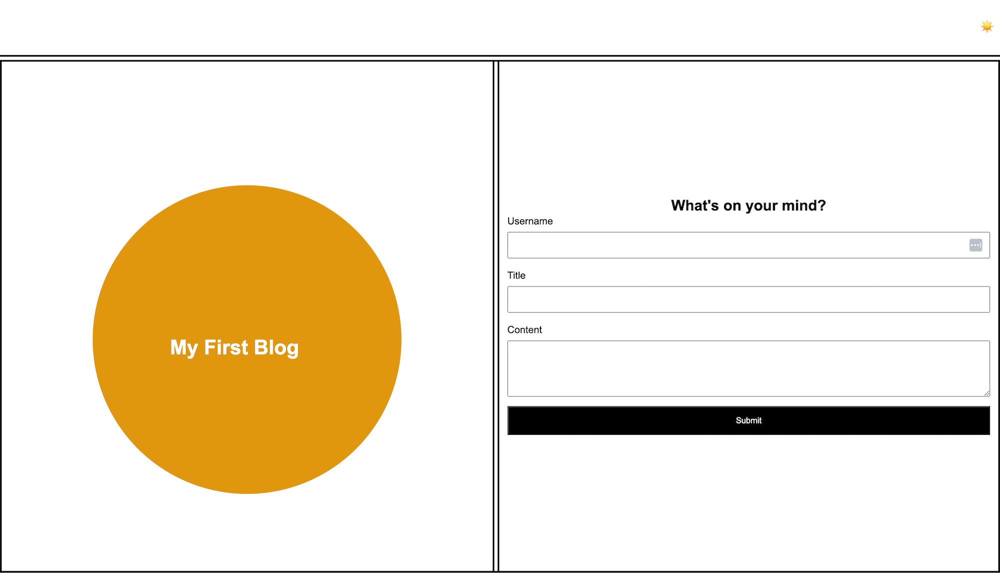
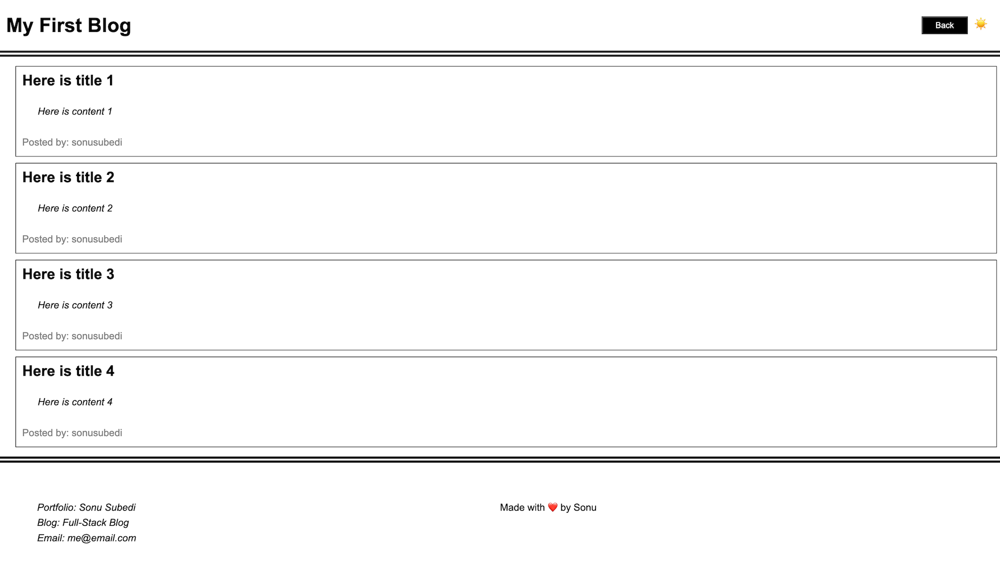

# Personal Blog Platform

Welcome to Personal Blog Platform! This platform allows users to create and view their blog posts. Here's a guide on how to use the platform and its features.

## Features

Landing Page: 

* Upon loading the application, user will land on the homepage. Home page contains a form to create blog posts and  option to switch between light mode/dark mode.

* The form includes fields for username, title, and content.

Light Mode/dark Mode Toggle:

* Switching between light mode and dark mode updates the page's content styles to reflect the selected mode.

Form Submission: 

* If any required fields in form section are missing, then user will be prompted to complete the form before submission.

* Upon submitting the form, the blog post data is stored in the browser's localStorage.

View Posts Page:

* After data is saved, user will be redirected to the posts page which displays list of blog posts.

* The page also includes option for light mode/dark mode, and "back" button.

Back button:

* Clicking the "Back" button returns user to the landing page, where user can create more post entries.

Main Content :

* The main content of the blog page displays a list of posts that are fetched from localstorage.

* Each blog post shows the title, content, and author's username.

LocalStorage:

* User can view the stored blog posts in the brower's localStorage, displayed as a JSON array.

Footer:

* The footer contains a link to the developer's portfolio inluding others.

## Technologies Used:

HTML, CSS, and JavaScript.

## Feedback and Contributions:

Feedback and Contributions are welcome! If you find any bugs or have suggestions for improvement, please open an issue or create a pull request.

## Developer

This Personal Blog Platform was created by Sonu Subedi.

## Webpage visual look

### Landing page

### Posts page

[Live URL](https://sonusubedi-01.github.io/personal-blog/index.html)

[GitHub Repository](https://github.com/sonusubedi-01/personal-blog)
